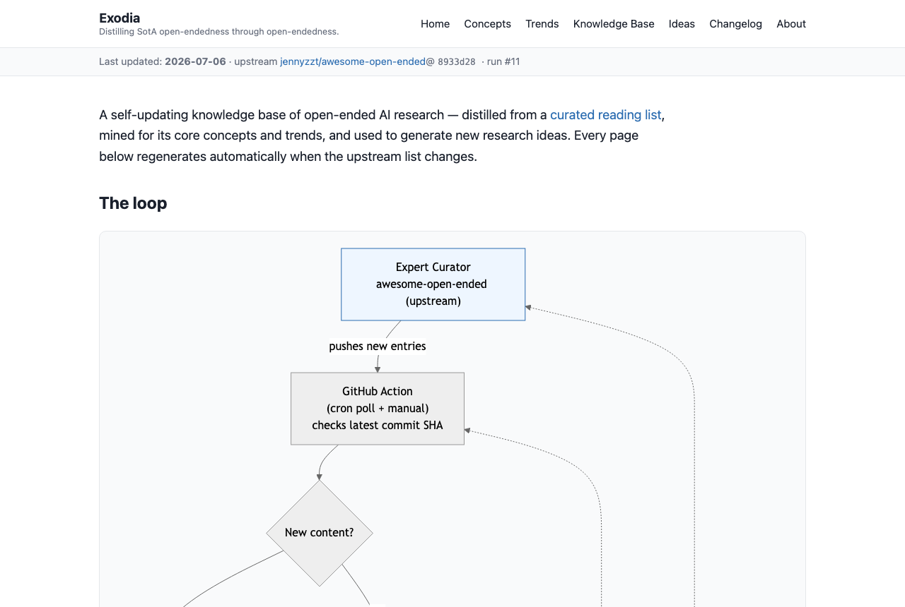

# Exodia

> **Distilling SotA open-endedness through open-endedness.**

[](https://github.com/ju2ez/exodia/actions/workflows/tests.yml)
[](https://github.com/ju2ez/exodia/actions/workflows/pipeline.yml)
[](LICENSE)
[](https://julianhatzky.me/exodia/)

[](https://julianhatzky.me/exodia/)

Exodia is a self-updating pipeline and website that watches Jenny
Zhang's curated [`awesome-open-ended`](https://github.com/jennyzzt/awesome-open-ended)
list, distills it into a structured knowledge base, generates and summarizes new
research ideas with [AI-Scientist-v2](https://github.com/SakanaAI/AI-Scientist-v2),
and publishes the result — with overview plots and a changelog — to GitHub Pages.

The project runs in a continuous loop *alongside* the field it documents. To be
precise: it **tracks and distills** open-endedness research — it is not (yet) an
open-ended *system* itself in the technical sense (perpetual novelty +
learnability), though it's built to grow toward one (see
[Toward genuine open-endedness](#toward-genuine-open-endedness)):

```
Expert Curator pushes new entries (awesome-open-ended)
        │
        ▼
GitHub Action polls upstream commit SHA  ──(no change)──▶ wait, loop stays open
        │ (new content)
        ▼
Ingest → Knowledge Base (structured metadata)
        ▼
Enrich: abstracts + full-text PDFs + video transcripts + citations
        ▼
Concept gazetteer + consensus / majority-vote theme analysis
        ▼
Idea generation & summarization  ──▶  AI-Scientist-v2 (Sakana AI)
        ▼
Build / update the Exodia site + changelog
        ▼
Deploy to GitHub Pages, commit state, loop
```

The full, rendered diagram (including the *future* paper-writing branch) appears
at the top of the published site.

## Toward genuine open-endedness

Today exodia is **reactive**: its novelty comes from the human-curated upstream
list and from the idea-generating LLM — not from its own dynamics. By the field's
working definition (Hughes et al., 2024), an open-ended system perpetually produces
artifacts that stay both *novel* and *learnable* to an observer; exodia doesn't
claim that. To actually become open-ended it would need to **close the loop on
itself**: generated ideas seeding searches/experiments whose results re-enter the
knowledge base and reshape what gets generated next, an *interestingness* model
steering ideation toward the novel-but-learnable frontier, less dependence on the
curated upstream as the sole source of novelty, and an explicit novelty +
learnability metric tracked across runs. That is the intended direction — not the
current state.

## How it works

A small Python package (`exodia`) runs each stage as a CLI subcommand and the whole
loop via `python -m exodia run-all`. State (the knowledge base, ideas, themes, and
changelog) lives as committed JSON under `data/`.

**Voting & feedback are backed by GitHub Issues** (one issue per idea), so the
published site can be a plain **static** build on GitHub Pages with no server: the
pipeline syncs ideas → issues, reads the 👍/👎 reaction + comment tallies back, and
bakes the counts and a ranked "best ideas" list into the page, which links out to
each issue to vote/discuss. For local development there's also an *optional*
**FastAPI** mode (`serve`) with in-page voting/feedback (SQLite) — same templates.

| Stage | Module | What it does |
|------|--------|--------------|
| Gate | `upstream.py` | Compares upstream's latest commit SHA against stored state |
| Parse | `parser.py` | Turns the upstream README markdown into structured entries |
| Enrich | `enrich.py` | Adds arXiv abstracts + `journal_ref`/`comment`/`doi` (rate-limited, cache-first) |
| PDFs | `pdfs.py` | Downloads full-text PDFs locally (cache-first, capped; git-ignored, not republished) |
| Venue | `venues.py` | Resolves the *real* publication venue (arXiv is a preprint server, not a venue) |
| Store | `store.py` | Merges into the knowledge base, tracks first/last seen |
| Diff | `diffing.py` | Computes the per-run changelog |
| Analyze | `analysis.py` | TF-IDF + clustering for consensus themes; each cluster lists all its papers |
| Ideate | `ideation.py` | Invokes AI-Scientist-v2; ideas get content-based ids + a novelty filter |
| Match | `matching.py` | Stars an idea when a newly-added paper essentially realizes it, and links to it |
| Plot | `plotting.py` | Interactive **Plotly** overview charts (growth, venues, themes, …), embedded inline |
| Vote | `issues.py` | One **GitHub Issue per idea** — 👍/👎 reactions = votes, comments = feedback; tallies baked into the site |
| Render | `render.py` | Jinja2 → static HTML site (votes + ranked best-idea list) |
| Serve | `webapp.py` + `db.py` | *Optional* local dynamic mode (**FastAPI** + SQLite) with in-page voting/feedback |

## Run it locally

```bash
# With uv (recommended):
uv venv && uv pip install -e ".[dev]"
# …or with pip:  pip install -r requirements.txt && pip install -e .

# Full pipeline with NO API cost (uses a fixture for the idea-generation step).
# Downloads full-text PDFs by default; cap or skip with --max-pdfs / --no-pdfs:
python -m exodia run-all --dry-run

# Optional local dynamic mode — in-page voting/feedback (FastAPI + SQLite).
# Local development ONLY: /api/rebuild and the feedback endpoint are
# unauthenticated — do not bind this to a public interface.
python -m exodia serve                 # http://127.0.0.1:8000

# Static preview of the Pages build (voting/feedback link out to GitHub Issues):
python scripts/dev_serve.py
```

**Secrets & config.** Copy `.env.example` to `.env` (it's git-ignored and loaded
automatically). Idea generation uses **Google Gemini** by default — set
`GEMINI_API_KEY` and point `EXODIA_AISCIENTIST_DIR` at a local clone of
AI-Scientist-v2 (switch `ideation.model` in `config.yaml` for OpenAI/Claude). Then:

```bash
python -m exodia run-all --force
```

**Voting via GitHub Issues.** With a `GITHUB_TOKEN` (and a `site.repo` /
`$GITHUB_REPOSITORY`), sync ideas to issues and pull the tallies into the site:

```bash
python -m exodia sync-issues           # creates/refreshes one issue per idea
python -m exodia render                # rebuild with the vote tallies + best list
```

The optional local FastAPI mode instead stores votes/feedback in `data/community.db`
(one vote per browser token; changeable/retractable); `POST /api/rebuild` reloads
content without a restart.

A weekly GitHub Action (`.github/workflows/pipeline.yml`) forces a run so a fresh,
*novel* idea is generated even when upstream is unchanged (near-duplicate ideas are
dropped by the novelty filter).

## Automation & deployment

`.github/workflows/pipeline.yml` runs the loop on a daily cron, a weekly cron, and
manual dispatch. It polls upstream and runs the pipeline when the SHA changed (or
when forced / on the weekly schedule), then **syncs ideas → GitHub Issues**
(`sync-issues`, using the built-in `GITHUB_TOKEN`), re-renders the site with the
fresh vote tallies, commits updated `data/` back, and **deploys `site/` to GitHub
Pages**. Because voting lives in Issues, no separate server is needed.

One-time setup: **Settings → Pages → Source = GitHub Actions**; ensure workflow
permissions allow `issues: write` and `pages: write` (declared in the workflow);
and add the secrets listed in `.env.example` (`GEMINI_API_KEY` for real ideation —
without it the weekly run uses the no-cost fixture).

## Credits, attribution & compliance

- **Knowledge base** is derived from
  [`awesome-open-ended`](https://github.com/jennyzzt/awesome-open-ended), curated
  by **Jenny Zhang**. The upstream repository publishes no license, so we store
  only factual metadata (titles, authors, venues, links) and **link back** to the
  originals — we do not republish upstream prose.
- **Idea generation & summaries** are produced by
  [AI-Scientist-v2](https://github.com/SakanaAI/AI-Scientist-v2) (**Sakana AI**),
  under the AI Scientist Source Code License. Machine-generated content is
  **clearly labeled** as such on the site, as that license requires.
- **Abstracts** are retrieved via the **arXiv API** and shown with attribution and
  a link back. **Full-text PDFs** are additionally downloaded (rate-limited,
  cache-first) for local analysis only — they are kept under `data/pdfs/`,
  git-ignored, and never redistributed or republished on the site.

See [`NOTICE`](NOTICE) for the full attribution and compliance details. This
project's own code is released under the [MIT License](LICENSE); no third-party
source code is vendored into this repository.

## Contributing

The most valuable contribution is **judgment**: vote on the generated ideas (👍/👎 on
their GitHub Issues) and critique them in comments. Details — including how to run
the pipeline locally and what's out of scope — in [CONTRIBUTING.md](CONTRIBUTING.md).

## Future work

The loop is intentionally left open. A future step could close it by invoking
AI-Scientist-v2's full experiment-and-write-up pipeline to draft an actual paper
from the highest-consensus ideas. That step is **not implemented** here and is
shown as a dashed branch in the site diagram.
